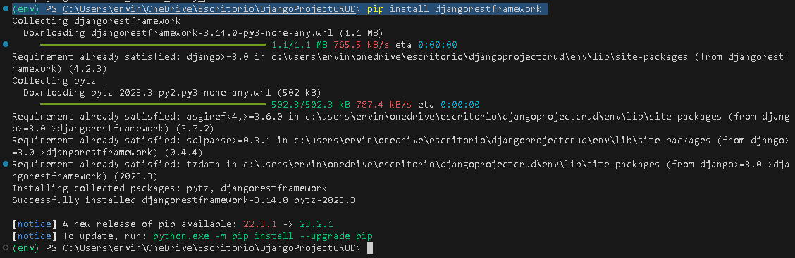

<table>
    <theader>
        <tr>
            <td></td>
            <th>
                UNIVERSIDAD NACIONAL DE SAN AGUSTIN 
                FACULTAD DE INGENIERÍA DE PRODUCCIÓN Y SERVICIOS 
                DEPARTAMENTO ACADÉMICO DE INGENIERÍA DE SISTEMAS E INFORMÁTICA 
                ESCUELA PROFESIONAL DE INGENIERÍA DE SISTEMAS
            </th>
            <td></td>
        </tr>
    </theader>
    <tbody>
        <tr><td colspan="3">Formato: Guía de Práctica de Laboratorio</td></tr>
        <tr><td>Aprobación:  2022/03/01</td><td>Código: GUIA-PRLD-001</td><td>Página: 1</td></tr>
    </tbody>
</table>

GUÍA DE LABORATORIO 

<table>
<theader>
<tr><th colspan="6">INFORMACIÓN BÁSICA</th></tr>
</theader>
<tbody>
<tr><td>ASIGNATURA:</td><td colspan="5">Programación Web 2</td></tr>
<tr><td>TÍTULO DE LA PRÁCTICA:</td><td colspan="5"> Django Rest Framework CRUD</td></tr>
<tr>
<td>NÚMERO DE PRÁCTICA:</td><td>08</td><td>AÑO LECTIVO:</td><td>2023 A</td><td>NRO. SEMESTRE:</td><td>III</td>
</tr>
<tr>
<td>FECHA INICIO::</td><td>18-Julio-2022</td><td>FECHA FIN:</td><td>27-Julio-2022</td><td>DURACIÓN:</td><td>04 horas</td>
</tr>
<tr><td colspan="6">RECURSOS:
    <ul>
        <li><a href="https://www.django-rest-framework.org/">https://www.django-rest-framework.org/</a></li>        
    </ul>
</td>
</<tr>
<tr><td colspan="6">DOCENTES:
<ul>
<li>Anibal Sardon </li>
</ul>
</td>
</<tr>
</tdbody>
</table>

# Django

[![License][license]][license-file]
[![Downloads][downloads]][releases]
[![Last Commit][last-commit]][releases]

[![Debian][Debian]][debian-site]
[![Git][Git]][git-site]
[![GitHub][GitHub]][github-site]
[![Vim][Vim]][vim-site]
[![Java][Java]][java-site]

#

## OBJETIVOS Y TEMAS

### OBJETIVOS

- Django Rest Framework facilita la implementación de una API RESTful completa y robusta, permitiendo que los desarrolladores se centren más en la lógica de negocio específica de la aplicación en lugar de dedicar tiempo a detalles repetitivos de implementación de la API.

### TEMAS

- Django Rest Framework
- CRUD

### MARCO TEORICO
- Se centra principalmente en comprender los conceptos y componentes clave de DRF, así como los principios fundamentales de las operaciones CRUD en una API RESTful. Aquí hay una breve descripción de los elementos importantes del marco teórico para DRF CRUD

### ACTIVIDADES
   Elabore un servicio web que tenga un CRUD con el uso de este framework.
- Create - POST
- Read - GET
- Update - PUT
- Delete - DELETE

Centrarce en el Core business de su aplicacion web. Los mas importante y necesario que este disponible a traves de un servicio web.
Ejemplos: https://reqbin.com/, https://www.googleapis.com/youtube/v3/playlistItems

Muestre la funcionalidad consumiendola desde el cliente Rest de su preferencia.

El metodo GET puede ser directamente consumido por un navegador web:
Por ejemplo: 
En esta API se puede obtener la temperatura de Arequipa en un rango de fechas: (La version gratuita tiene un retraso de 7 dıas, por tanto solo mostrar ́a la temperatura en Arequipa desde el 01 de Julio hasta el 03 de Julio)

https://archive-api.open-meteo.com/v1/archive?latitude=-16.39889&amp;longitude=-71.535&amp;
start_date=2023-07-01&end_date=2023-07-10&hourly=temperature_2m&daily=temperature_
2m_max,temperature_2m_min&timezone=America%2FNew_York

#

## INFORME DE LABORATORIO

## Django Rest Framwork

- Primero instalamos el Django Rest Framework

    - 
    - 
    - 
    - 
    - 
    - 
    - 
    - https://github.com/ifs570/DjangoLab8/blob/master/drfsimplecrud/img/img1.PNG

- Instalamos los cors

    -  

- Añadimos Rest_Framwork y cors dentro de settings.py

    - 

- Añadimos los cors dentro de MiddleWARE

    - 

- Agregamos una configuración para saber que servidor puede conectarse

    - 

- Ejecutamos y cambia la ruta inicial

    - 
  
- Entramos a la ruta http://127.0.0.1:8000/api/projects/" Podemos observar que la base de datos esta vacia, por que me devuelve un arreglo vacío.

    - 

- Creamos peticiones POST.

    - 
    - 

- Ahora para realizar una peticion GET, PUT y DELETE instalamos thunder client

    - 
    - 

- En settings.py

    - 
    - 
    - 

- En producción usaremos PostgreSQL, usaremos la version gratuita

    - 
    - 
    - 

- Instalamos dependencias necesarias

    -  
    -  
    -  

- En desarrollo usaremos db.sqlite3 y en producción postgres

    -  

- Agregamos algunos cambios 

    - 
    - 

- Necesitamos ejecutar una serie de comandos para construir nuestra aplicación. Podemos lograr esto con un script de compilación. Creamos un script llamado build.sh en la raíz de su repositorio:

    - 

- Asegúremos de que el script sea ejecutable antes de registrarlo en Git:

    - 

- Vamos a ejecutar nuestra aplicación con gunicorn

    - 

- Creamos variables de entorno

    - 
    - 

- Generamos la url

    - 
    - 
    - 

- Vemos la url e ingresamos

    - 

- https://djangorestcrud-62c4.onrender.com
- Al abrir la url nos da

    - 

#

#

## REFERENCIAS
- Documentación: https://www.django-rest-framework.org/
- Render: https://render.com/
- Render PosgresDB: https://dashboard.render.com/d/dpg-cj0l7h18g3n9bruo9mi0-a
#

[license]: https://img.shields.io/github/license/rescobedoq/pw2?label=rescobedoq
[license-file]: https://github.com/rescobedoq/pw2/blob/main/LICENSE

[downloads]: https://img.shields.io/github/downloads/rescobedoq/pw2/total?label=Downloads
[releases]: https://github.com/rescobedoq/pw2/releases/

[last-commit]: https://img.shields.io/github/last-commit/rescobedoq/pw2?label=Last%20Commit

[Debian]: https://img.shields.io/badge/Debian-D70A53?style=for-the-badge&logo=debian&logoColor=white
[debian-site]: https://www.debian.org/index.es.html

[Git]: https://img.shields.io/badge/git-%23F05033.svg?style=for-the-badge&logo=git&logoColor=white
[git-site]: https://git-scm.com/

[GitHub]: https://img.shields.io/badge/github-%23121011.svg?style=for-the-badge&logo=github&logoColor=white
[github-site]: https://github.com/

[Vim]: https://img.shields.io/badge/VIM-%2311AB00.svg?style=for-the-badge&logo=vim&logoColor=white
[vim-site]: https://www.vim.org/

[Java]: https://img.shields.io/badge/java-%23ED8B00.svg?style=for-the-badge&logo=java&logoColor=white
[java-site]: https://docs.oracle.com/javase/tutorial/

[![Debian][Debian]][debian-site]
[![Git][Git]][git-site]
[![GitHub][GitHub]][github-site]
[![Vim][Vim]][vim-site]
[![Java][Java]][java-site]

[![License][license]][license-file]
[![Downloads][downloads]][releases]
[![Last Commit][last-commit]][releases]
